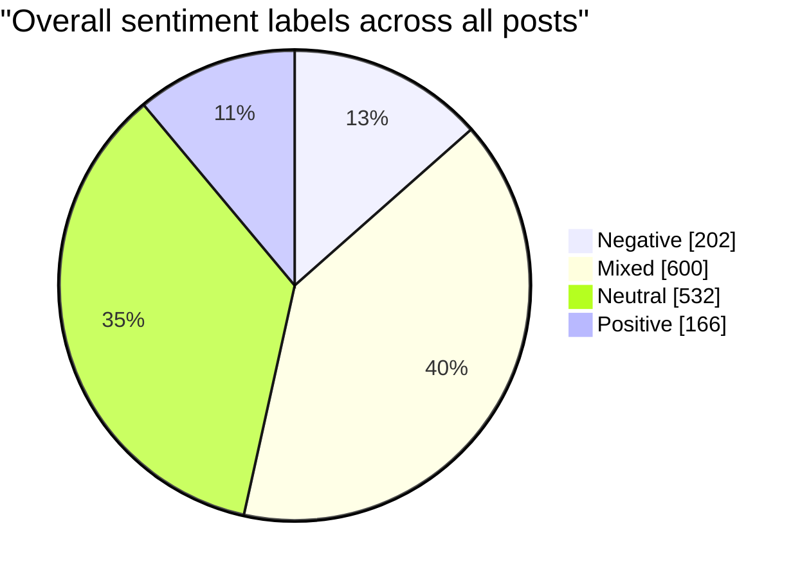
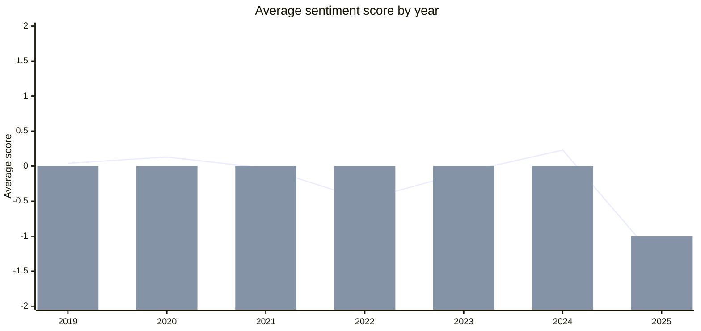
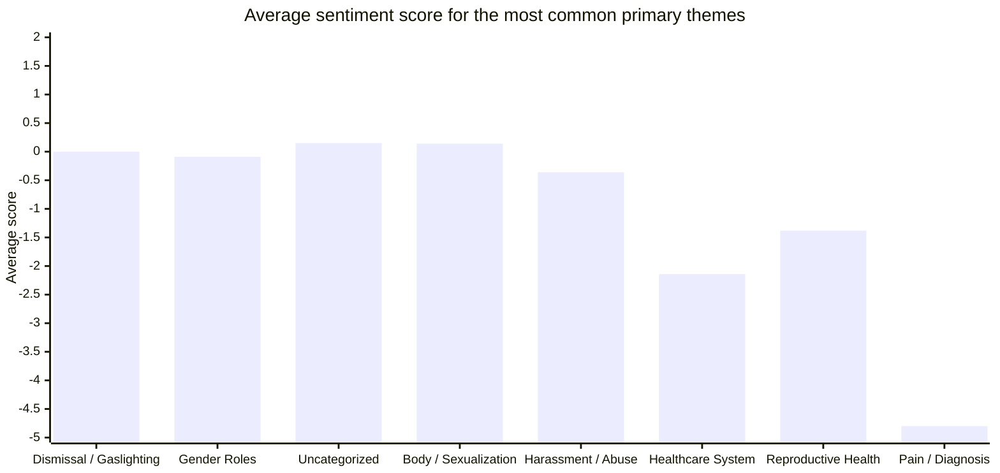

# EDSP Sentiment Stats

Generated from `Sorting/sorted.json`.

## Summary

- Total posts analyzed: 1500
- Years covered: 2019, 2020, 2021, 2022, 2023, 2024, 2025
- Overall average sentiment score: -0.12
- Lowest / highest sentiment score: -15 / 8

## Overall Sentiment Distribution

## Sentiment Counts by Year

```mermaid
---
config:
    xyChart:
        width: 1100
        height: 520
---
xychart-beta
    title "Sentiment label counts by year"
    x-axis ["2019", "2020", "2021", "2022", "2023", "2024", "2025"]
    y-axis "Posts" 0 --> 168
    bar [24, 45, 44, 16, 24, 2, 47]
    bar [102, 158, 142, 44, 87, 18, 49]
    bar [132, 115, 140, 32, 80, 18, 15]
    bar [26, 59, 36, 10, 20, 5, 10]
```

## Average Sentiment Score by Year

## Average Sentiment Score by Major Theme

## Theme Coverage Used For Score Chart

- Dismissal / Gaslighting: 521 posts, average score -0.00
- Gender Roles: 295 posts, average score -0.09
- Uncategorized: 246 posts, average score 0.15
- Body / Sexualization: 199 posts, average score 0.14
- Harassment / Abuse: 169 posts, average score -0.36
- Healthcare System: 37 posts, average score -2.14
- Reproductive Health: 16 posts, average score -1.38
- Pain / Diagnosis: 10 posts, average score -4.80
